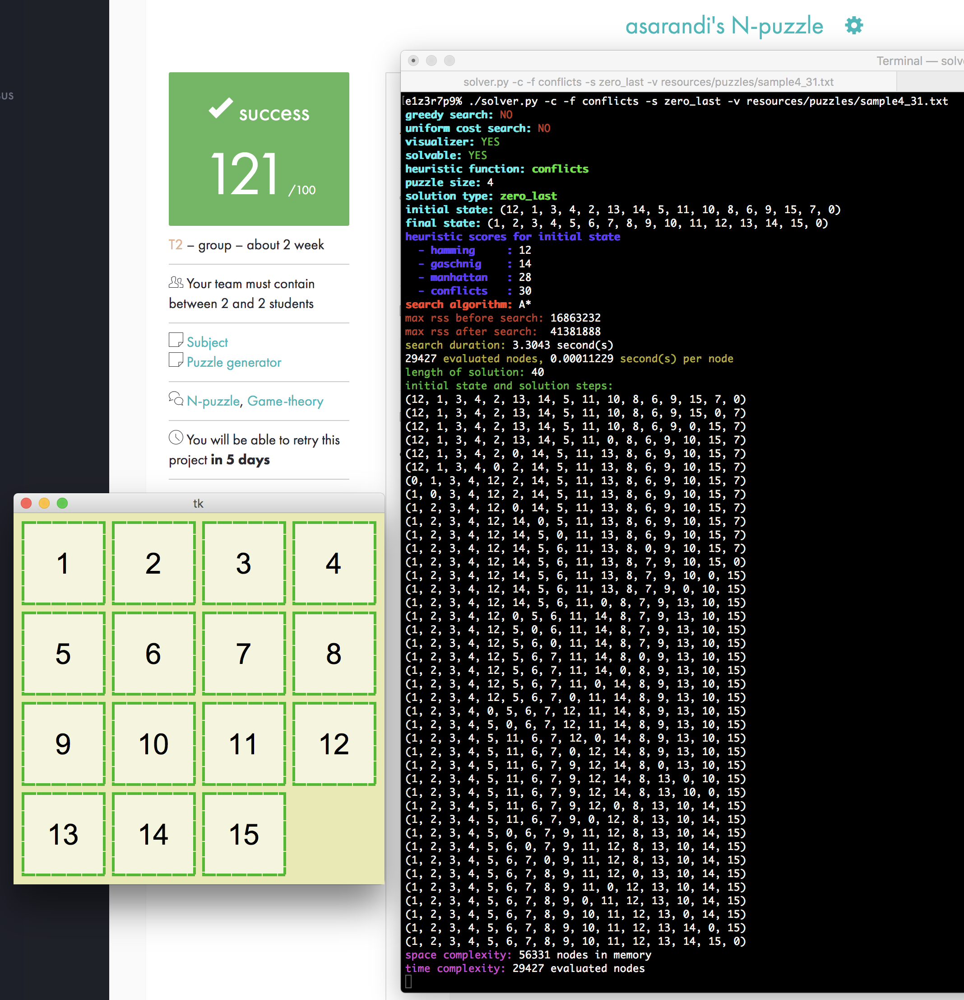

# n-puzzle @ 42 fremont

```
usage: solver.py [-h] [-c] [-ida] [-g] [-u]
                 [-f {hamming,gaschnig,manhattan,conflicts}]
                 [-s {zero_first,zero_last,snail}] [-p] [-v]
                 file

n-puzzle @ 42 fremont

positional arguments:
  file                  input file

optional arguments:
  -h, --help            show this help message and exit
  -c                    colors
  -ida                  ida* search
  -g                    greedy search
  -u                    uniform-cost search
  -f {hamming,gaschnig,manhattan,conflicts}
                        heuristic function
  -s {zero_first,zero_last,snail}
                        solved state
  -p                    pretty print solution steps
  -v                    gui visualizer
```

#### search:

default search is **A\***
- fast and efficient
- memory heavy

or use `-ida` for **IDA\***
- light on memory
- slower than a\*


#### input puzzle configurations:
`-s zero_first` (blank tile first)

```
4
00 01 02 03
04 05 06 07
08 09 10 11
12 13 14 15
```


`-s zero_last` (blank tile last)
```
4
01 02 03 04
05 06 07 08
09 10 11 12
13 14 15 00
```

`-s snail` (default, spiral pattern)
```
4
01 02 03 04
12 13 14 05
11 00 15 06
10 09 08 07
```

#### heuristics:
`-f hamming` hamming distance aka "tiles out of place"

`-f gaschnig` performs better than hamming distance

`-f manhattan` manhattan distance heuristic (default)

`-f conflicts` linear conflicts usually more informed than manhattan distance


#### miscellaneous:
`-g` greedy search: ignores the `g(n)` in A\* formula `f(n) = g(n) + h(n)`, quickly finds a **suboptimal** solution

`-u` uniform cost search: discards the `h(n)` in A\* formula (turns off heuristics and becomes dijkstra's, slow)

`-c` colors in terminal output

`-p` pretty print solution steps

`-v` replay solution steps in graphical visualizer


[](resources/screenshot.png "resources/screenshot.png")
